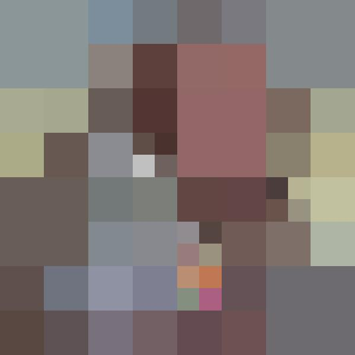
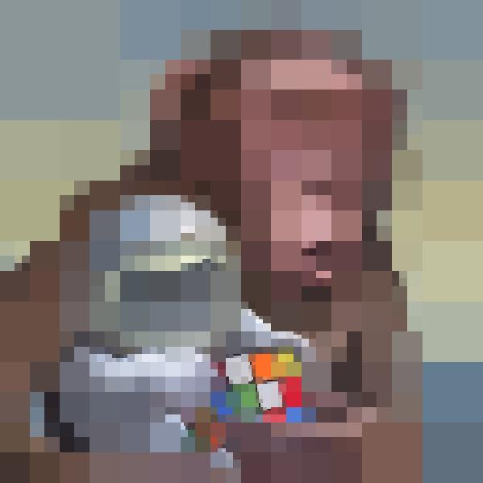
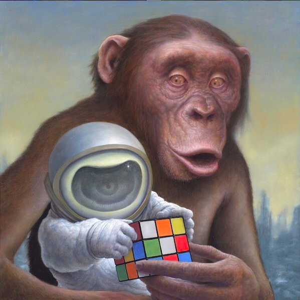

# QuadImage
Image manipulation with quadtrees. The image is split into 4 quadrants, which are each given an average colours based on the colours of the pixels in that quadrant. The quadrant which has the largest error (similar to standard deviation) relative to the number of times it has been split, will then again be split into 4 quadrants. This process is repeated an arbitrary number of times, continuously increasing the clarity of the image.

| Iterations | 20              | 200                 
| ---        | ---    | ---     
| Image      |  |  

| 2000          | 20000         | Real Image
| ---        | ---    | ---     
|  |  | 

Inspiration from https://www.michaelfogleman.com/projects/quads/
