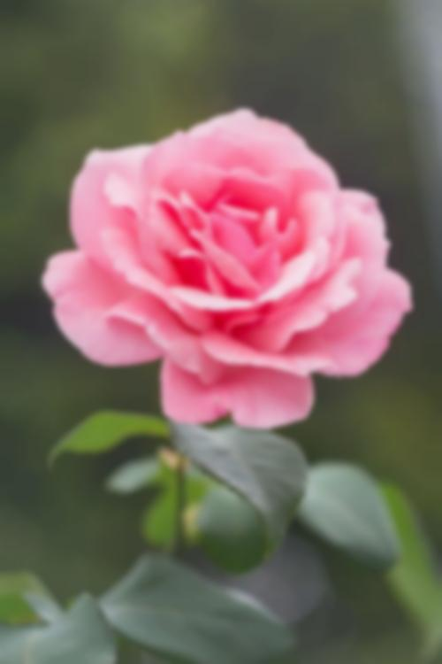
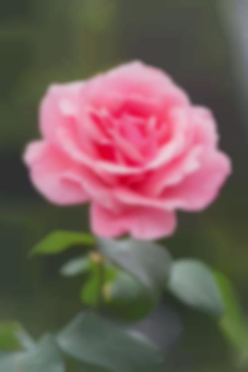
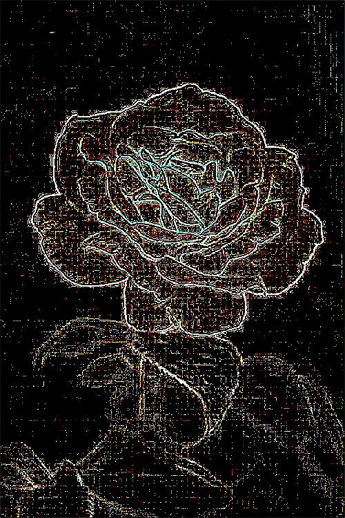

# QuadImage

Please see USAGE.md before using.

Image manipulation program with 3 features, QuadImage, Blur and Edge Detection.

#### QuadImage

Image manipulation with quadtrees. The image is split into 4 quadrants, each of which is given an average colour based on the colours of the pixels in that quadrant. The quadrant with the largest average colour error (a metric similar to standard deviation), will then again be split into 4 quadrants. This process is repeated an arbitrary number of times, continuously increasing the clarity of the image.


| Iterations | 20              | 200                 
| ---        | ---    | ---     
| Image      |  |  


| 2000          | 20000         | Real Image
| ---        | ---    | ---     
|  |  | 

Inspiration from https://www.michaelfogleman.com/projects/quads/

#### Blur
Performs a box blur on a given image an arbitrary number of times, resulting in a progressively blurrier image.
A box blur is a filter where each pixel is set to the average colour (average RGB value) of its 8 surrounding neighbours and itself. 

More explanation at https://en.wikipedia.org/wiki/Box_blur.


| Blur level | 0              | 25                 
| ---        | ---    | ---     
| Image      |  |  


| 50          | 75         | 100
| ---        | ---    | ---     
|  |  | 

#### Edge Detection
Performs a Laplacian edge detection on the given image. A Lapliacian edge detection is a single pass on the given image, applying the following filter on each pixels colour (RGB values).
```
 0 -1  0
-1  4 -1
 0 -1  0
```
| Original Image | Laplacian Edge Detection           
| ---        | ---   
|        |  

